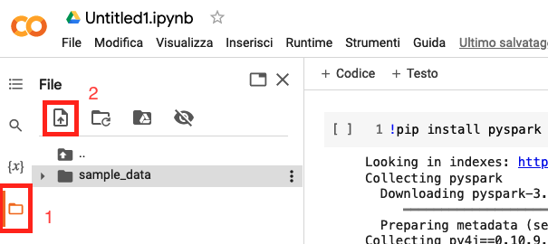

# PySpark Installation Guide
This guide was created for the students of the "Distributed architectures for big data processing and analytics" course at Politecnico di Torino.
**This guide must be used only in case you want to run your application without using the distributed cluster.**
**On the distributed cluster, everything is already configured and ready to run Spark application.**
**Please follow this guide only in case you want to execute applications on your own, without the distributed cluster.**

It will guide you on the installation of JupyterLab + PySpark.

Three options are available to run your code locally:
 - Google Colab
 - Your own computer
 - LABINF's computer


## Google Colab
** Requirement: you need a Google account to be able to use Google Colab. Internet connection is required to run the code. **
This is the easiest solution and it does not require any configuration.

### Configuration

Steps:
 - Go to the Colab's entry page ([link](https://colab.research.google.com/))
 - Create a new notebook
 - (optional) Verify that **no** Accellerator (GPU/TPU) is being used
    - Runtime -> Change runtime type -> Accelerator: None
 - Connect to a runtime by going into the top-right corner of the notebook and clicking `Connect`
 - After connection, Colab should report RAM and Disk usage
 - Install PySpark by running a cell with the following code: `!pip install pyspark`
 - Instantiate a SparkSession by running the following code in a cell:
```
from pyspark.sql import SparkSession

spark = SparkSession.builder.getOrCreate()
sc = spark.sparkContext
```

You can find an example here.

### Data upload
To upload sample files on Google Colab, you can either:
 - upload files from your laptop
 
 - use the command line given the download link:
 ```
 !wget download_link
 ```

## Local Installation
To locally install PySpark on your own computer, we suggest you to use Anaconda/Miniconda.
If you do not have Miniconda installed on your system, you can find instructions and installers at this [link](https://docs.conda.io/en/latest/miniconda.html).
Same can be performed using `pip` and `virtualenv`.

Steps (after installation):
 - (optional) Create a conda environment by opening a terminal (Anaconda/Miniconda terminal on Windows)
 ```
    conda create -n pyspark python=3.10
 ```
 - Activate the newly created environment
 ```
    conda activate pyspark
 ```
 - Install JupyterLab and PySpark
 ```
    conda install jupyterlab pyspark
 ```

### Open the JupyterLab web interface
To open the JupyterLab web interface, you need to:
 - open a terminal (Anaconda/Miniconda terminal on windows)
 - go to the directory in which you want to start and save your notebook
 ```
    cd your_path
 ```
 - start JupyterLab
 ```
    conda activate pyspark
    jupyter lab
 ```

## LABINF Installation
If you want to use LABINF's computer, you need to install PySpark locally.
 - open a terminal (Anaconda terminal on windows)
 - install pyspark
 ```
    pip install pyspark
 ```

Then, you can launch JupyterLab by the [Open the JupyterLab web interface](#Open-the-JupyterLab-web-interface) section, skipping the `conda activate` command.
**One last additional step must be followed when running your application in LABINF:**
the `PYSPARK_PYTHON` environment variable must be set. You can simply write the following code in the first cell and execute it:

```
    import os

    os.environ['PYSPARK_PYTHON'] = 'C:\\tools\\Anaconda3\\python.exe'
```

You can find an example here.